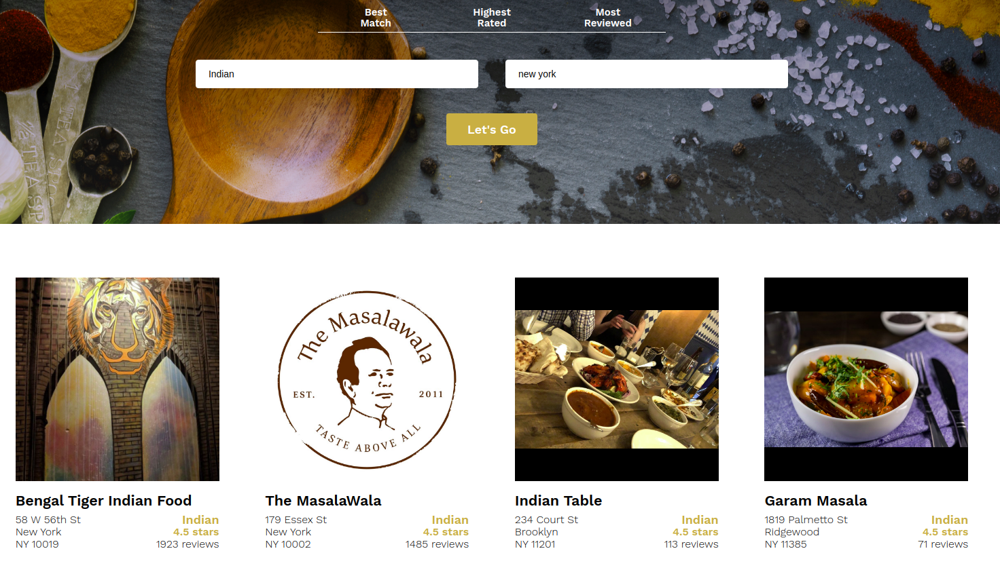

# Hunger Search
As part of Codecademy project, this is a yelp-like clone website using React and Yelp API.

This project was bootstrapped with [Create React App](https://github.com/facebook/create-react-app).

---
## Available Scripts

In the project directory, you can run:

### `npm start`

Runs the app in the development mode. 
Open [http://localhost:3000](http://localhost:3000) to view it in the browser.

The page will reload if you make edits. 
You will also see any lint errors in the console.

---
## Project details
Here’s a quick overview of how Hunger search will function:

* As a user, I should be able to search for restaurants.
* As a user, I should be able to view a list of restaurants returned by the Yelp API.
* As a user, I should be able to sort through restaurants using a filter.

 

This Project is divided into **4 parts**:-

1. Creating Static Components.
2. Passing Information to Components.
3. Setting the State of Hunger Search Components.
4. Interacting with the Yelp API.

---
## Part-1

We shall have four different components, interacting with each other.
* `<Business />`
* `<BusinessList />`
* `<SearchBar />`
* `<App />` (created by default with create-react-app)

For time being in the part-1 we have all the four components without functionality, and the functionality will be added in the later parts. 

Inside the **src/** directory a **components** folder is created for the respective components.

Inside the components directory we have four folders.

* **App** (contains `App.js` and `App.css`)
* **Business** (contains `Business.js` and `Business.css`)
* **BusinessList** (contains `BusinessList.js` and `BusinessList.css`)
* **SearchBar** (contains `SearchBar.js` and `SearchBar.css`)
 

The purpose of the `<Business />` component is to represent how a business (a restaurant) in Hunger Search will be formatted and styled. For now, we’ll hard code a single business listing. Later, we shall update it dynamically using the Yelp API.
 

The point of the `<BusinessList />` component is to simulate what a returned list of businesses would look like in Hunger Search(after querying the Yelp API, for example). To help this simulation, `<BusinessList />` will make use of the `<Business />` component repeatedly.`<Business />` component is imported to `<BusinessList`.
 

The search bar will communicate with the Yelp API, but we shall build the functionality to communicate with the API in a later part of the project. Specifically, requests to the Yelp API must follow formatting and naming conventions set by the API. For example, the search bar should allow users to search businesses by:

* Best Match
* Highest Rated
* Most Reviewed

To achieve this, we created an object with keys and values that conform to what the API expects to receive.

Inside the `<SearchBar />` we have written a method. The purpose of renderSortByOptions() is to dynamically create the list items needed to display the sort options (Best Match, Highest Rated, Most Reviewed). This is to help future proof against potential changes to the Yelp API.

The method iterates through the keys and values of the sortByOptions object and return a list item. The list item will should use the keys as an attribute, and the values as content.

Fianlly `<App />` component imports `<BusinessList />` and `<SearchBar />` components.

---

### Final Summary of Part-1
 

A `<Business />` component that simulates a single business.

A `<BusinessList />` component that simulates a list of single businesses.

A `<SearchBar />` component that will be used in the future to search for business.

The `<App />` component renders a `<SearchBar />` component and a `<BusinessList />` component. The final product is a simulation of how the Hunger Search project will look and work. Some functionality (like querying the Yelp API) is currently missing, but we shall build it in the upcoming parts.

---
## The webpage image

